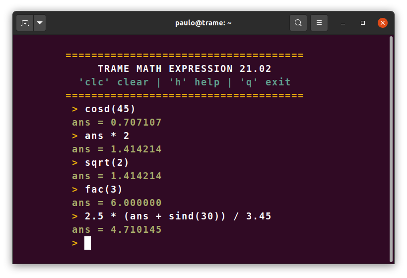

# TRAME MATH EXPRESSION 21.02




Simple REPL (Read-Eval-Print Loop) software based on TinyExpr parser and evaluation engine for math expressions with some additional functions.

## Features

- REPL interface.
- Use the last expression result by **ans** variable.
- Clear screen function by **clc** command.
- Simple and fast.


## Usage

Configure the directory **path** in the **.bashrc** file and type the **math** command in the terminal.

```C
Example:

export PATH="$PATH:/home/<user>/tramemath"

```


## Functions supported

TinyExpr engine supports addition (+), subtraction/negation (-), multiplication (\*), division (/), exponentiation (^) and modulus (%) with the normal operator
precedence (the one exception being that exponentiation is evaluated
left-to-right, but this can be changed - see below).

The following C math functions are also supported:

- abs (calls to *fabs*), acos, asin, atan, atan2, ceil, cos, cosh, exp, floor, ln (calls to *log*), log (calls to *log10* by default, see below), log10, pow, sin, sinh, sqrt, tan, tanh

The following functions are also built-in and provided by TinyExpr:

- fac (factorials e.g. `fac 5` == 120)
- ncr (combinations e.g. `ncr(6,2)` == 15)
- npr (permutations e.g. `npr(6,2)` == 30)

Also, the following constants are available:

- `pi`, `e`

### Addional functions

- ans (Return the last result)

- cosd, sind, tand (input angles in decimal notation)


